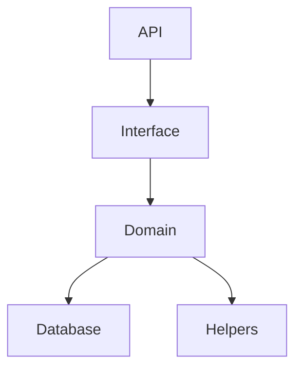

# Reddit API Clone
### Minimal reddit api clone (Backend only)

## Installation & setup
1. Clone the repository
2. Run `npm install`
3. Run `node app.js`
4. Server will be running on `http://localhost:3000`

## Environment variables
There are 2 variables needed to be set, 
It would be advised to get your own, 
if needed please contact me via email

1. DATABASE_URL
2. API_SECRET

## Calling API from post man 
1. Create a user using the `Create User` API
2. Login using the `User Login` API -> Return JWT toke and add it to the header { "authorization" : <token>}
3. Use the token to create a post using the `Create Post` API

## Code structure

## API Docs
Please read the [API_Docs.md](API_Docs.md) for more information
