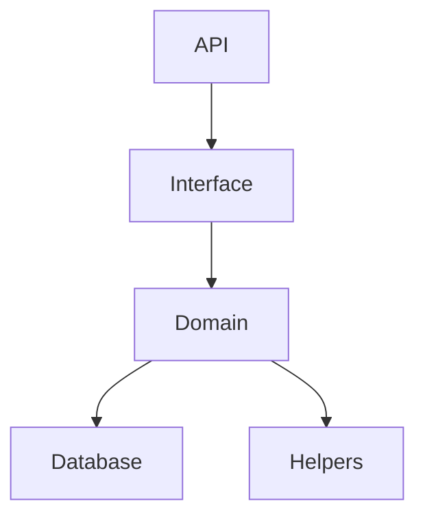

# Reddit API Clone
### Minimal reddit api clone (Backend only)

## Installation & setup
1. Clone the repository
2. Run `npm install`
3. Run `node app.js`
4. Server will be running on `http://localhost:3000`

## Code structure

## API Endpoints

### User
 - [x] POST /user/login/email/{email}/password/{password}
 - [x] POST /user/create/name/{name}/email/{email}/password/{password}

### Post
 - [x] POST /post/create/title/{title}/content/{title}/user/{userId}
 - [x] POST /post/upvote/post/{postId}/user/{userId}
 - [x] POST /post/downvote/post/{postId}/user/{userId}
 - [x] GET /post/read/user/{userId}
 - [x] DELETE /post/delete/post/{postId}/user/{userId}
 - [x] POST /post/update/title/{title}/post/{postId}/user/{userId}
 - [x] POST /post/update/content/{content}/post/{postId}/user/{userId}

### Comment
 - [x] POST /comment/create/post/{postId}/user/{userId}/content/{content}
 - [x] GET /comment/read/post/{postId}
 - [x] DELETE /comment/delete/comment/{commentId}/user/{userId}
 - [x] POST /comment/update/content/{content}/comment/{commentId}/user/{userId}
 - [x] POST /comment/upvote/comment/{commentId}/user/{userId}
 - [x] POST /comment/downvote/comment/{commentId}/user/{userId}