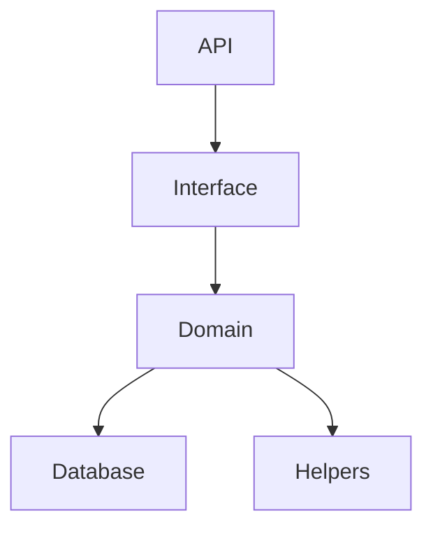

# redditAPIClone
Minimal reddit api clone (Backend only)

## Installation & setup
1. Clone the repository
2. Run `npm install`
3. Run `node app.js`
4. Server will be running on `http://localhost:3000`

## Code structure

